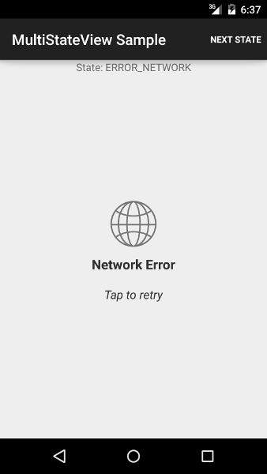
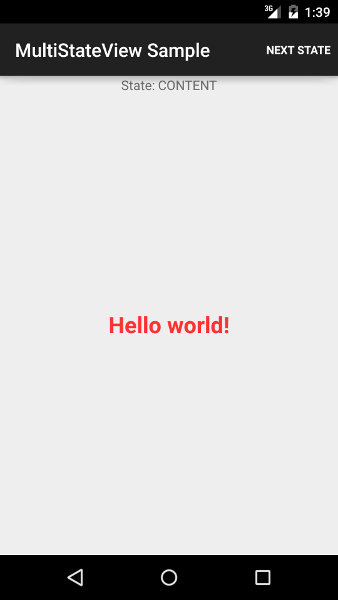

# MultiStateView
Handles multiple display states for data-centric views

 - Content state; shows the inner content of the View (as defined in XML)
 - Loading state; shows a Loading state (as specified either via the `loadingLayout` attribute, or the default layout (`res/layout/msv__loading.xml`)

The following shows examples (using default layouts) for **Loading**, **General Error**, **Network Error**, and the **Content** states (where we've made the "Hello World" the content) in respective order.


 


## Usage

 - For whatever `View` you want to switch out with `MultiStateView`, wrap the `View` in a `MultiStateView` node.
 - In code, get your reference to the child of `MultiStateView` via `MultiStateView#getContentView()` and cast that value as needed. There's no good reason to put an `android:id` on the child `View`.

**Example**

- Assuming you're starting with:

```xml
        <LinearLayout
            xmlns:android="http://schemas.android.com/apk/res/android"
            android:layout_width="fill_parent"
            android:layout_height="fill_parent"
            android:orientation="vertical" >

            <ListView
                android:id="@+id/list"
                android:layout_width="fill_parent"
                android:layout_height="match_parent" />

        </LinearLayout>
```

- You should end up with something like:

```xml
        <LinearLayout
            xmlns:android="http://schemas.android.com/apk/res/android"
            android:layout_width="fill_parent"
            android:layout_height="fill_parent"
            android:orientation="vertical" >

            <com.meetme.android.multistateview.MultiStateView
                android:id="@+id/list_container"
                android:layout_width="match_parent"
                android:layout_height="match_parent">

                <ListView
                    android:layout_width="fill_parent"
                    android:layout_height="match_parent" />

            </com.meetme.android.multistateview.MultiStateView>

        </LinearLayout>
```

  **Example Notes**
 0. `android:id="@+id/list"` was moved from the `ListView` to the `MultiStateView`
 0. It was also renamed to `list_container` to note that it now is the parent of the `ListView`
 0. Any references in code should now use `MultiStateView#getContentView()` casted to `ListView` to reference the `ListView` child. There's no good reason to put an `id` on the `ListView`. See below.

- In code,

```java
ListView list = (ListView) findViewById(R.id.list);
```

- Becomes

```java
MultiStateView container = (MultiStateView) findViewById(R.id.list_container);
ListView list = (ListView) container.getContentView();
```

- To control the state of the `MultiStateView`, use the `MultiStateView#setState(State)` method.

```java
container.setState(State.LOADING);
```

- By default, "Loading" indication uses the loading layout provided in the library (`res/layout/msv__loading.xml`). To customize, you can add the custom attribute `msvLoadingLayout` to the `MultiStateView` in XML with a reference to the layout to inflate.

## Contributors
 - [Dallas Gutauckis](http://github.com/dallasgutauckis)

## License

 Apache 2.0

    Copyright 2013 MeetMe, Inc.

    Licensed under the Apache License, Version 2.0 (the "License");
    you may not use this file except in compliance with the License.
    You may obtain a copy of the License at

        http://www.apache.org/licenses/LICENSE-2.0

    Unless required by applicable law or agreed to in writing, software
    distributed under the License is distributed on an "AS IS" BASIS,
    WITHOUT WARRANTIES OR CONDITIONS OF ANY KIND, either express or implied.
    See the License for the specific language governing permissions and
    limitations under the License.

## Contributing

To make contributions, fork this repository, commit your changes, and submit a pull request.
